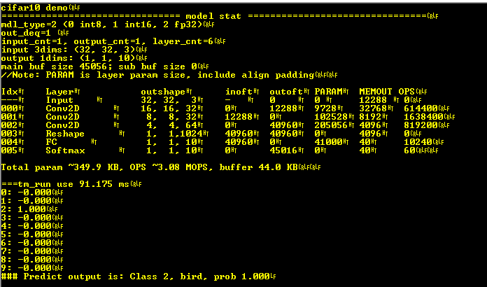
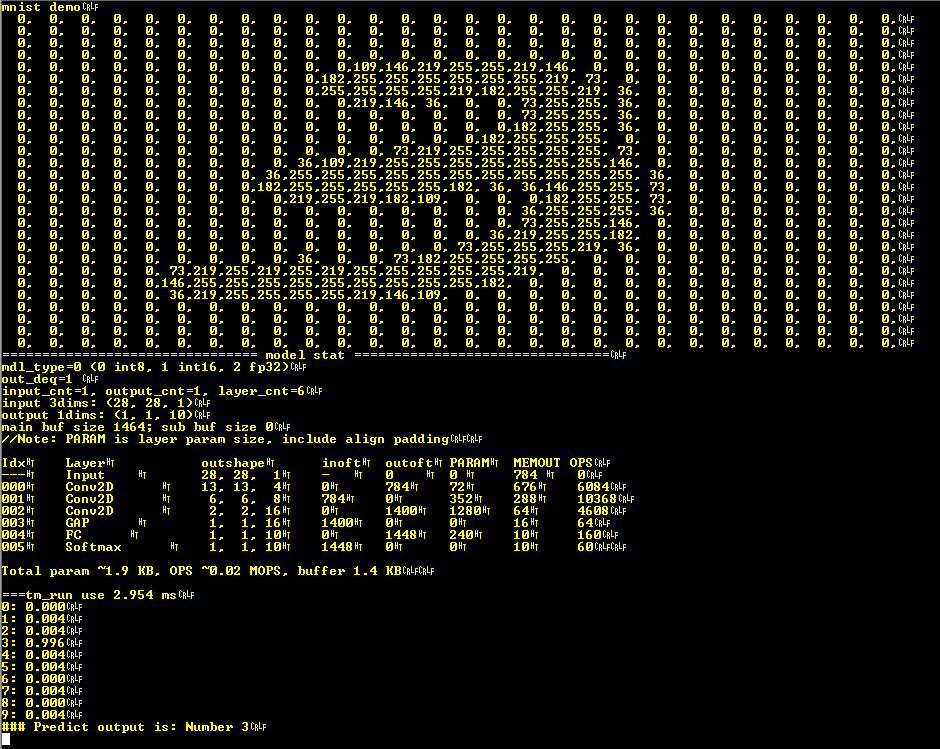
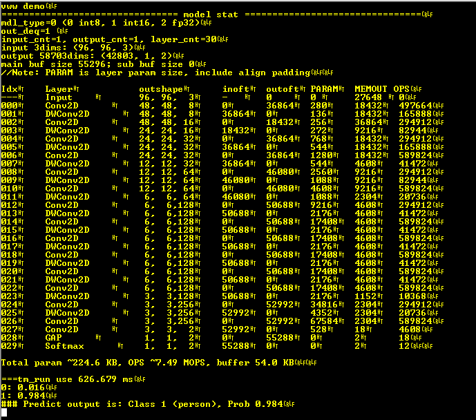
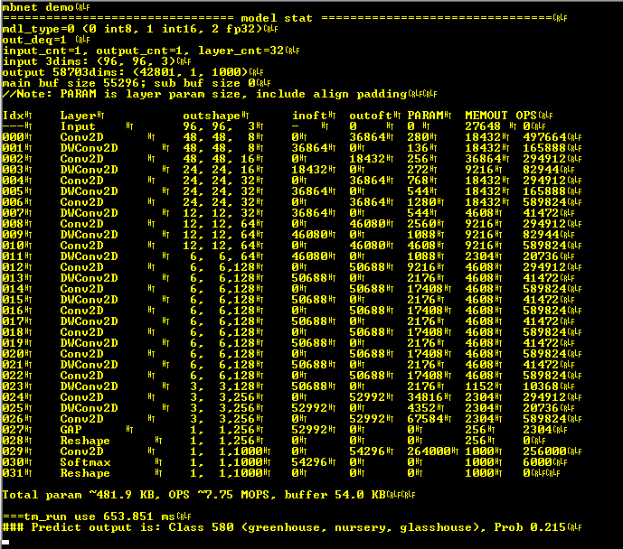
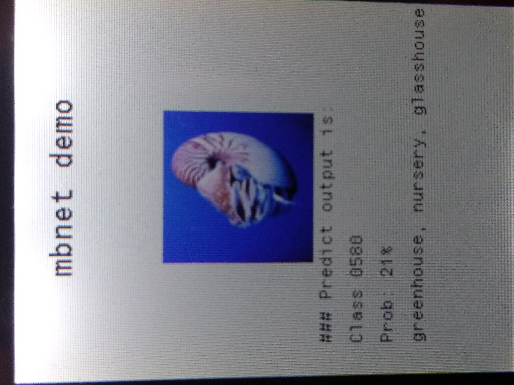

# TinyMaix_EDUCIAA
Implementación de TinyMaix en la plataforma [**EDU-CIAA**](http://www.proyecto-ciaa.com.ar/devwiki/doku.php?id=desarrollo:edu-ciaa:edu-ciaa-nxp)

## CIFAR10

  
  

## MNIST

## vww

## MBNET

